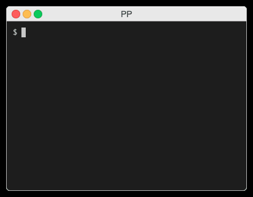

# pp 🍻
Simple tool for running configured SSH command on multiple mapped servers at once written in [GO](https://en.wikipedia.org/wiki/Go_(programming_language)) ❤️.
Originally built for running [Puppet](https://puppet.com/) 🤗.

# Build 🧱
The configuration file is compiled into a binary file, so you must create your own `config.yaml` file first (inspire in `config.example.yaml`).
Compilation is possible with Docker or GO.
There are prepared Makefile targets. For example `build.darwin`, `build.linux`, `build.windows`.
Then move `pp` binary file to your local bin dir (see `make mv`).

# Usage 🚀
 `pp` starts HTTP server to which are stdout & stderr of running SSHs streamed.
It will search free TCP port in range specified in config file.
You can visit it in browser, URL will be displayed to stdout of running `pp`.
After SSH commands finishes, you must interrupt `pp` (ctrl^c) - it keeps HTTP server started with rendered outputs.

Be aware of:
- Your SSH client must be configured to not require any user input on connection to configured servers
- Linux has reserved ports (0-1023) - if needed, configure higher `portRange` in config file

With provided (`config.example.yaml`) you can run for example
- `pp dev fe`
- `pp dev,stage api,web`

